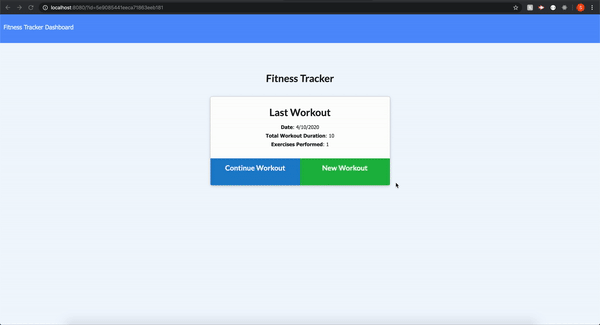

# 17-Fitness-Tracker

# Description 

This app is a **F**itness **T**racker for tracking the users workouts along with the exercises in their workouts. 

```
As a user, I want to be able to view create and track workouts. I want to be able to log multiple exercises in a workout. I should also be able to track the name, type, weight, sets, reps, and duration of exercise. If the exercise is a cardio exercise, I should be able to track my distance traveled.
```

# DEMO 


## Installation

* Ensure that Node and npm are installed on your computer to run this application. 

* Use the [mongoose](https://www.npmjs.com/package/mongoose) NPM package to connect to your mongo database and perform queries.

* Use [express](https://www.npmjs.com/package/express) NPM for handling routes .

## Functionality 

* Users can add new workouts and add as many exercises as they would like to each workout 
* They can view the duration of their current workout along with the number of exercises they have completed 
  * Exerciese can be either cardio or resistance based 
